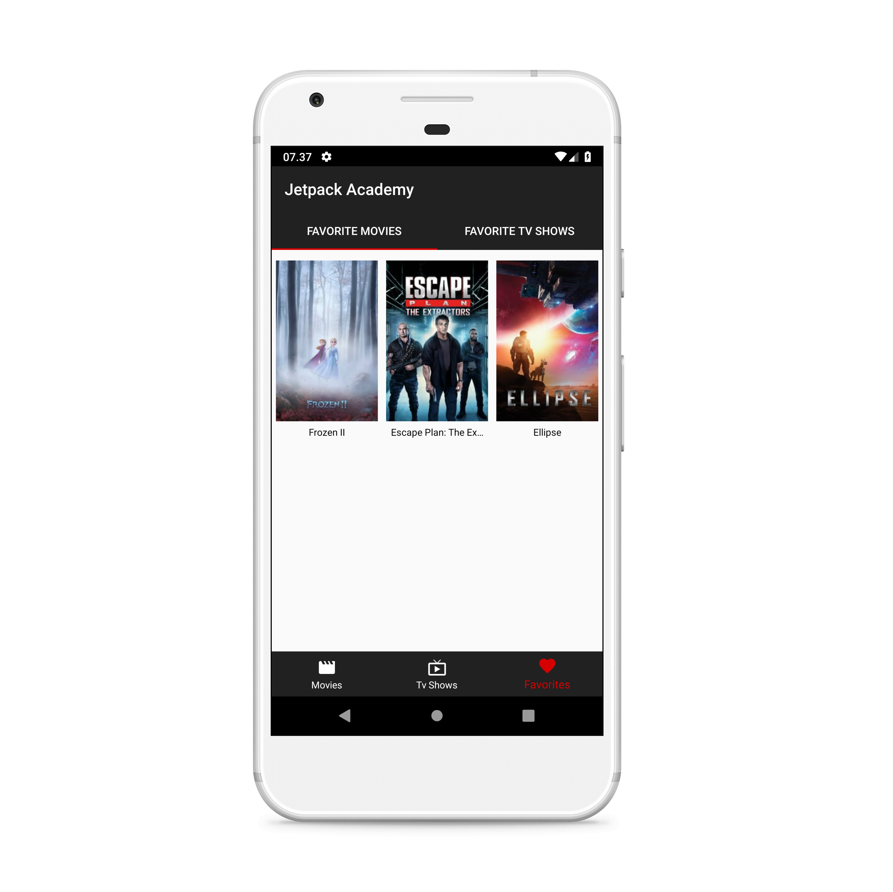
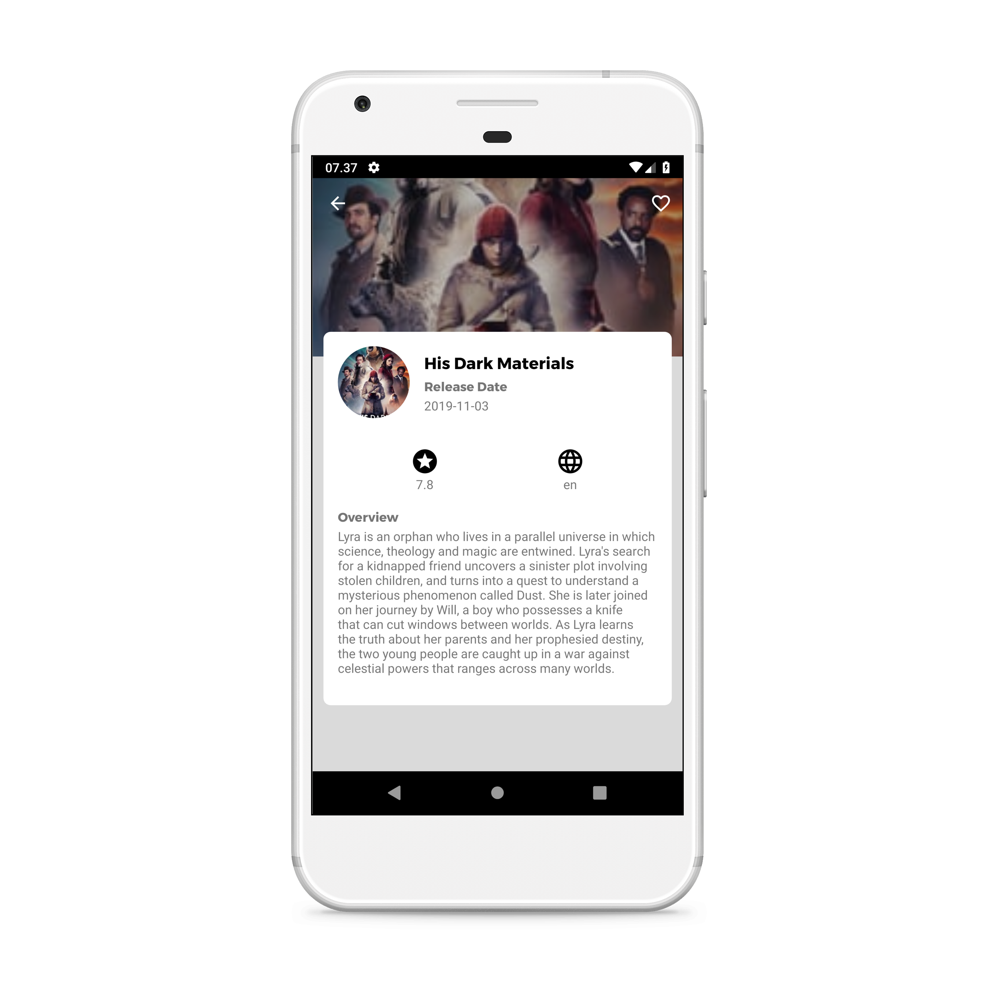

# JetpackAcademy
Project Jetpack Academy Dicoding

## Deskripsi
_Project_ __Jetpack Academy__ adalah _submission project_ untuk kelas [__Dicoding - Belajar Jetpack Pro__](https://www.dicoding.com/academies/129/). Repository ini berisi _source code_ utuh dari _submission_ awal sampai _submission_ final.
Repository ini juga memiliki _branch_ untuk masing-masing submission.

## Tampilan aplikasi
